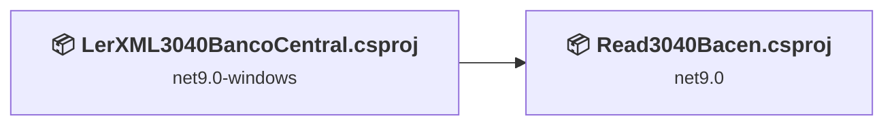
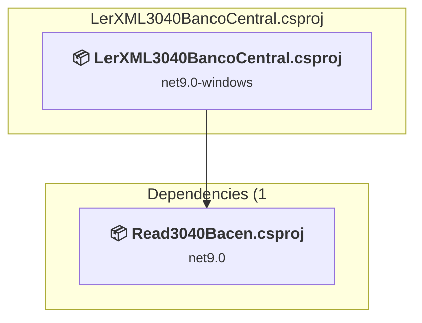
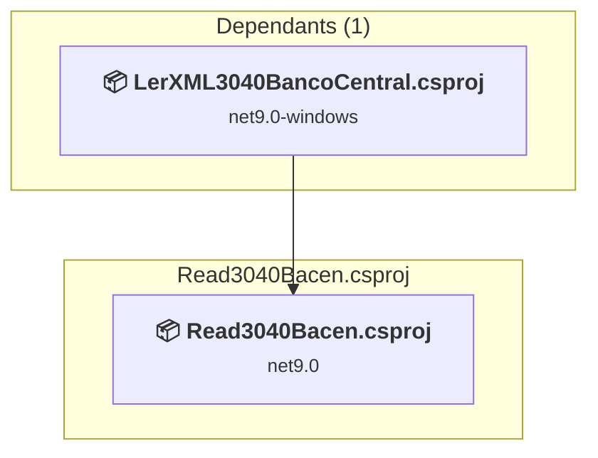

# Projects and dependencies analysis

This document provides a comprehensive overview of the projects and their dependencies in the context of upgrading to .NETCoreApp,Version=v10.0.

## Table of Contents

- [Executive Summary](#executive-Summary)
  - [Highlevel Metrics](#highlevel-metrics)
  - [Projects Compatibility](#projects-compatibility)
  - [Package Compatibility](#package-compatibility)
  - [API Compatibility](#api-compatibility)
- [Aggregate NuGet packages details](#aggregate-nuget-packages-details)
- [Top API Migration Challenges](#top-api-migration-challenges)
  - [Technologies and Features](#technologies-and-features)
  - [Most Frequent API Issues](#most-frequent-api-issues)
- [Projects Relationship Graph](#projects-relationship-graph)
- [Project Details](#project-details)

  - [LerXML3040BancoCentral\LerXML3040BancoCentral.csproj](#lerxml3040bancocentrallerxml3040bancocentralcsproj)
  - [Read3040Bacen\Read3040Bacen.csproj](#read3040bacenread3040bacencsproj)

## Executive Summary

### Highlevel Metrics

| Metric | Count | Status |
| :--- | :---: | :--- |
| Total Projects | 2 | All require upgrade |
| Total NuGet Packages | 0 | All compatible |
| Total Code Files | 42 |  |
| Total Code Files with Incidents | 7 |  |
| Total Lines of Code | 7021 |  |
| Total Number of Issues | 166 |  |
| Estimated LOC to modify | 164+ | at least 2,3% of codebase |

### Projects Compatibility

| Project | Target Framework | Difficulty | Package Issues | API Issues | Est. LOC Impact | Description |
| :--- | :---: | :---: | :---: | :---: | :---: | :--- |
| [LerXML3040BancoCentral\LerXML3040BancoCentral.csproj](#lerxml3040bancocentrallerxml3040bancocentralcsproj) | net9.0-windows | 🟡 Medium | 0 | 163 | 163+ | WinForms, Sdk Style = True |
| [Read3040Bacen\Read3040Bacen.csproj](#read3040bacenread3040bacencsproj) | net9.0 | 🟢 Low | 0 | 1 | 1+ | ClassLibrary, Sdk Style = True |

### Package Compatibility

| Status | Count | Percentage |
| :--- | :---: | :---: |
| ✅ Compatible | 0 | 0,0% |
| ⚠️ Incompatible | 0 | 0,0% |
| 🔄 Upgrade Recommended | 0 | 0,0% |
| ***Total NuGet Packages*** | ***0*** | ***100%*** |

### API Compatibility

| Category | Count | Impact |
| :--- | :---: | :--- |
| 🔴 Binary Incompatible | 159 | High - Require code changes |
| 🟡 Source Incompatible | 2 | Medium - Needs re-compilation and potential conflicting API error fixing |
| 🔵 Behavioral change | 3 | Low - Behavioral changes that may require testing at runtime |
| ✅ Compatible | 6676 |  |
| ***Total APIs Analyzed*** | ***6840*** |  |

## Aggregate NuGet packages details

| Package | Current Version | Suggested Version | Projects | Description |
| :--- | :---: | :---: | :--- | :--- |

## Top API Migration Challenges

### Technologies and Features

| Technology | Issues | Percentage | Migration Path |
| :--- | :---: | :---: | :--- |
| Windows Forms | 159 | 97,0% | Windows Forms APIs for building Windows desktop applications with traditional Forms-based UI that are available in .NET on Windows. Enable Windows Desktop support: Option 1 (Recommended): Target net9.0-windows; Option 2: Add <UseWindowsDesktop>true</UseWindowsDesktop>; Option 3 (Legacy): Use Microsoft.NET.Sdk.WindowsDesktop SDK. |

### Most Frequent API Issues

| API | Count | Percentage | Category |
| :--- | :---: | :---: | :--- |
| T:System.Windows.Forms.CheckBox | 14 | 8,5% | Binary Incompatible |
| T:System.Windows.Forms.Button | 11 | 6,7% | Binary Incompatible |
| T:System.Windows.Forms.OpenFileDialog | 10 | 6,1% | Binary Incompatible |
| T:System.Windows.Forms.Label | 10 | 6,1% | Binary Incompatible |
| T:System.Windows.Forms.TextBox | 9 | 5,5% | Binary Incompatible |
| P:System.Windows.Forms.Control.Name | 5 | 3,0% | Binary Incompatible |
| T:System.Windows.Forms.Application | 4 | 2,4% | Binary Incompatible |
| T:System.Windows.Forms.Control.ControlCollection | 4 | 2,4% | Binary Incompatible |
| P:System.Windows.Forms.Control.Controls | 4 | 2,4% | Binary Incompatible |
| M:System.Windows.Forms.Control.ControlCollection.Add(System.Windows.Forms.Control) | 4 | 2,4% | Binary Incompatible |
| P:System.Windows.Forms.Control.TabIndex | 4 | 2,4% | Binary Incompatible |
| P:System.Windows.Forms.Control.Size | 4 | 2,4% | Binary Incompatible |
| P:System.Windows.Forms.Control.Location | 4 | 2,4% | Binary Incompatible |
| T:System.Windows.Forms.DialogResult | 4 | 2,4% | Binary Incompatible |
| T:System.Windows.Forms.Cursor | 4 | 2,4% | Binary Incompatible |
| T:System.Windows.Forms.AutoScaleMode | 3 | 1,8% | Binary Incompatible |
| T:System.Windows.Forms.CheckState | 3 | 1,8% | Binary Incompatible |
| P:System.Windows.Forms.FileDialog.FileName | 3 | 1,8% | Binary Incompatible |
| T:System.Xml.Serialization.XmlSerializer | 3 | 1,8% | Behavioral Change |
| T:System.Windows.Forms.MessageBox | 3 | 1,8% | Binary Incompatible |
| M:System.Windows.Forms.MessageBox.Show(System.String) | 3 | 1,8% | Binary Incompatible |
| T:System.Windows.Forms.HighDpiMode | 2 | 1,2% | Binary Incompatible |
| T:System.Windows.Forms.Padding | 2 | 1,2% | Binary Incompatible |
| P:System.Windows.Forms.ButtonBase.UseVisualStyleBackColor | 2 | 1,2% | Binary Incompatible |
| P:System.Windows.Forms.ButtonBase.Text | 2 | 1,2% | Binary Incompatible |
| P:System.Windows.Forms.CheckBox.Checked | 2 | 1,2% | Binary Incompatible |
| M:System.Windows.Forms.OpenFileDialog.#ctor | 2 | 1,2% | Binary Incompatible |
| M:System.String.Concat(System.ReadOnlySpan{System.String}) | 2 | 1,2% | Source Incompatible |
| T:System.Windows.Forms.Cursors | 2 | 1,2% | Binary Incompatible |
| P:System.Windows.Forms.Control.Cursor | 2 | 1,2% | Binary Incompatible |
| M:System.Windows.Forms.Form.#ctor | 2 | 1,2% | Binary Incompatible |
| F:System.Windows.Forms.HighDpiMode.SystemAware | 1 | 0,6% | Binary Incompatible |
| M:System.Windows.Forms.Application.SetHighDpiMode(System.Windows.Forms.HighDpiMode) | 1 | 0,6% | Binary Incompatible |
| M:System.Windows.Forms.Application.SetCompatibleTextRenderingDefault(System.Boolean) | 1 | 0,6% | Binary Incompatible |
| M:System.Windows.Forms.Application.EnableVisualStyles | 1 | 0,6% | Binary Incompatible |
| M:System.Windows.Forms.Application.Run(System.Windows.Forms.Form) | 1 | 0,6% | Binary Incompatible |
| M:System.Windows.Forms.Control.PerformLayout | 1 | 0,6% | Binary Incompatible |
| M:System.Windows.Forms.Control.ResumeLayout(System.Boolean) | 1 | 0,6% | Binary Incompatible |
| P:System.Windows.Forms.Form.Text | 1 | 0,6% | Binary Incompatible |
| M:System.Windows.Forms.Padding.#ctor(System.Int32) | 1 | 0,6% | Binary Incompatible |
| P:System.Windows.Forms.Form.Margin | 1 | 0,6% | Binary Incompatible |
| P:System.Windows.Forms.Form.ClientSize | 1 | 0,6% | Binary Incompatible |
| F:System.Windows.Forms.AutoScaleMode.Font | 1 | 0,6% | Binary Incompatible |
| P:System.Windows.Forms.ContainerControl.AutoScaleMode | 1 | 0,6% | Binary Incompatible |
| P:System.Windows.Forms.ContainerControl.AutoScaleDimensions | 1 | 0,6% | Binary Incompatible |
| F:System.Windows.Forms.CheckState.Checked | 1 | 0,6% | Binary Incompatible |
| P:System.Windows.Forms.CheckBox.CheckState | 1 | 0,6% | Binary Incompatible |
| P:System.Windows.Forms.ButtonBase.AutoSize | 1 | 0,6% | Binary Incompatible |
| E:System.Windows.Forms.Control.Click | 1 | 0,6% | Binary Incompatible |
| P:System.Windows.Forms.TextBoxBase.ReadOnly | 1 | 0,6% | Binary Incompatible |

## Projects Relationship Graph

Legend:
📦 SDK-style project
⚙️ Classic project

## Project Details

### LerXML3040BancoCentral\LerXML3040BancoCentral.csproj

#### Project Info

- **Current Target Framework:** net9.0-windows
- **Proposed Target Framework:** net10.0-windows
- **SDK-style**: True
- **Project Kind:** WinForms
- **Dependencies**: 1
- **Dependants**: 0
- **Number of Files**: 22
- **Number of Files with Incidents**: 5
- **Lines of Code**: 1370
- **Estimated LOC to modify**: 163+ (at least 11,9% of the project)

#### Dependency Graph

Legend:
📦 SDK-style project
⚙️ Classic project

### API Compatibility

| Category | Count | Impact |
| :--- | :---: | :--- |
| 🔴 Binary Incompatible | 159 | High - Require code changes |
| 🟡 Source Incompatible | 1 | Medium - Needs re-compilation and potential conflicting API error fixing |
| 🔵 Behavioral change | 3 | Low - Behavioral changes that may require testing at runtime |
| ✅ Compatible | 2135 |  |
| ***Total APIs Analyzed*** | ***2298*** |  |

#### Project Technologies and Features

| Technology | Issues | Percentage | Migration Path |
| :--- | :---: | :---: | :--- |
| Windows Forms | 159 | 97,5% | Windows Forms APIs for building Windows desktop applications with traditional Forms-based UI that are available in .NET on Windows. Enable Windows Desktop support: Option 1 (Recommended): Target net9.0-windows; Option 2: Add <UseWindowsDesktop>true</UseWindowsDesktop>; Option 3 (Legacy): Use Microsoft.NET.Sdk.WindowsDesktop SDK. |

### Read3040Bacen\Read3040Bacen.csproj

#### Project Info

- **Current Target Framework:** net9.0
- **Proposed Target Framework:** net10.0
- **SDK-style**: True
- **Project Kind:** ClassLibrary
- **Dependencies**: 0
- **Dependants**: 1
- **Number of Files**: 21
- **Number of Files with Incidents**: 2
- **Lines of Code**: 5651
- **Estimated LOC to modify**: 1+ (at least 0,0% of the project)

#### Dependency Graph

Legend:
📦 SDK-style project
⚙️ Classic project

### API Compatibility

| Category | Count | Impact |
| :--- | :---: | :--- |
| 🔴 Binary Incompatible | 0 | High - Require code changes |
| 🟡 Source Incompatible | 1 | Medium - Needs re-compilation and potential conflicting API error fixing |
| 🔵 Behavioral change | 0 | Low - Behavioral changes that may require testing at runtime |
| ✅ Compatible | 4541 |  |
| ***Total APIs Analyzed*** | ***4542*** |  |

